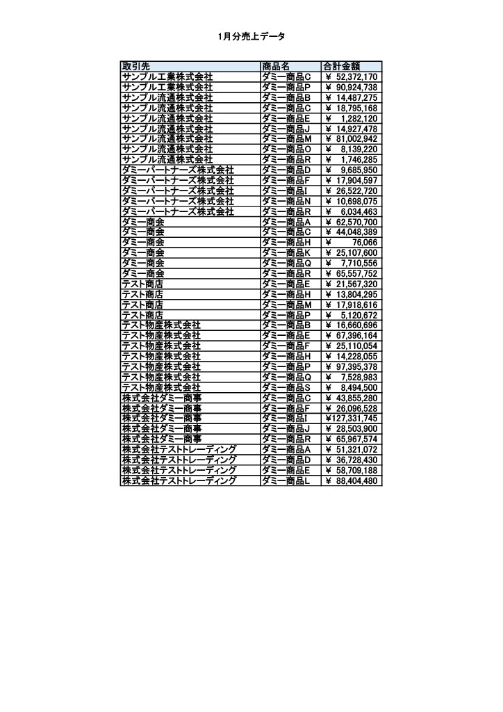
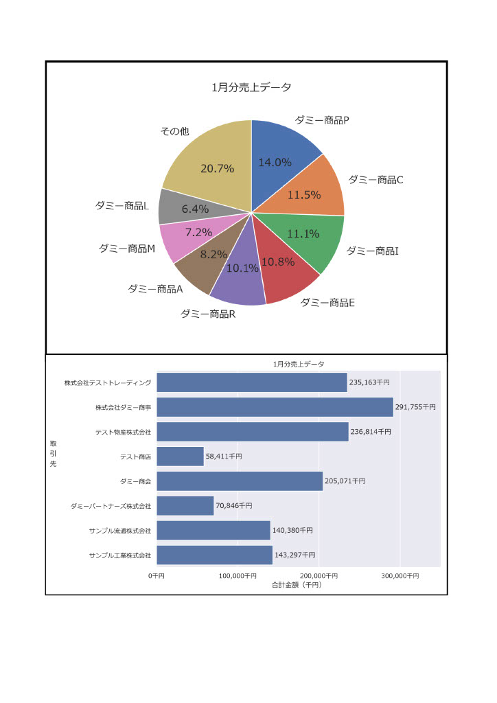

# python-monthy-sales-automation
## 概要
- Excelで記入した売上データを月ごとに自動集計し、PDFとして出力するシステムです。
## 目的
- 毎月の売上データ集計業務を想定し、当プロジェクトの作成を始めました。
- VBAが使用できない環境下での自動化システム開発にPythonを使用しました。
## 実行結果
### 1月分の売上データの場合（ダミーデータです）


## 機能
* 実行時に以下のファイルが出力されます。加工前Excelデータに複数のシートがある場合、各シートごとに以下ファイル群を出力し、各シート名がそのままファイル名として出力されます。
  - 加工済みExcelファイル（xlsx形式）
  - グラフ結果画像（png形式）（円グラフ・棒グラフ）
  - PDFファイル
* 実行時にターミナル内に以下の内容が表示されます（print文にて）
  - 各ファイル・フォルダの作成完了通知
  - 加工済みExcelファイルにグラフ結果の画像添付通知
  - Excelファイル読み込み完了通知
  - 各pyファイルの実行完了通知
  - エラー発生通知（例外メッセージ）
- 各ファイル（Excel,PDF等）格納フォルダが存在しない場合、実行時に自動生成されます。
## 実行方法
1. requrements.txt内のライブラリをインストール
2. data/raw内に加工前のExcelファイル（拡張子はxlsx形式）をそのまま配置
3. main.pyを当プロジェクト内のメインディレクトリ直下内に配置し実行（メインディレクトリ直下の外で実行するとエラーとなります）
4. 実行時に各処理の完了通知と各ファイル・フォルダが出力されます
## 使用技術
- python 3.12.10
- pandas 3.0.5
- matplotlib 3.11.1
- seaborn 0.13.2
- openpyxl 3.1.5
- pywin 312
- pytest 9.1.1
## 設計意図
### 想定されるエラーへの対策（エラーハンドリング）
* 以下のエラー発生を想定し、エラー発生時にraiseにてユーザー側にわかるように内容を通知し、プログラムを終了する設計にしました。
#### 加工前Excelファイルへの加工
- Excelファイルの読み込みに失敗した（パスが不正）
- 加工前Excelファイルが存在しない（フォルダ内に配置していない）
- データ内容がそもそも存在しない（中身が空のExcelファイル）
- 加工に必要な列が1つでも欠けている
- 数字を記入する列に数字以外が含まれている
#### 円グラフ（matplotlib.pieplot）用のデータ加工
- 合計金額が0
#### PDF出力
- 各グラフpngファイル（円グラフ・棒グラフ）が見つからない
### グラフ描写について
- Excel内のグラフを使用せず、豊富な描写、設定手段を持つmatplotlibとseabornを用いてグラフを作成しました。
### pyファイル内のフォルダ構成について
* 責務を分散させるため、以下のモジュール構成にしました。
  - common: 各処理pyファイルで共通して使用する処理を格納するフォルダ
  - process: 本処理（加工済みExcel出力・グラフ画像出力など）pyファイルを格納するフォルダ
### テストコードについて
- pytestを用いて、本処理にて保証される処理のテストコードを追加しました。
## ディレクトリ構成
```
python-monthly-sales-automation
├── data
│   ├── processed
│   └── raw 
├── outputs
│   ├── pdf
│   └── plot
├── result
│   ├── result_1.jpg
│   └── result_2.jpg
├── src
│   ├── common
│   │   ├── __init__.py
│   │   ├── columns.py
│   │   ├── data_process.py
│   │   ├── path_general.py
│   │   └── plot_general.py
│   ├── process
│   │   ├── __init__.py
│   │   ├── bar_plot.py
│   │   ├── export_excel.py
│   │   ├── export_pdf.py
│   │   └── pie_plot.py
│   └── __init__.py
├── test
│   ├── __init__.py
│   ├── conftest.py
│   ├── test_bar_plot.py
│   ├── test_data_process.py
│   ├── test_export_excel.py
│   ├── test_export_pdf.py
│   └── test_pie_plot.py
├── .gitignore
├── main.py
├── README.md
└── requirements.txt
```